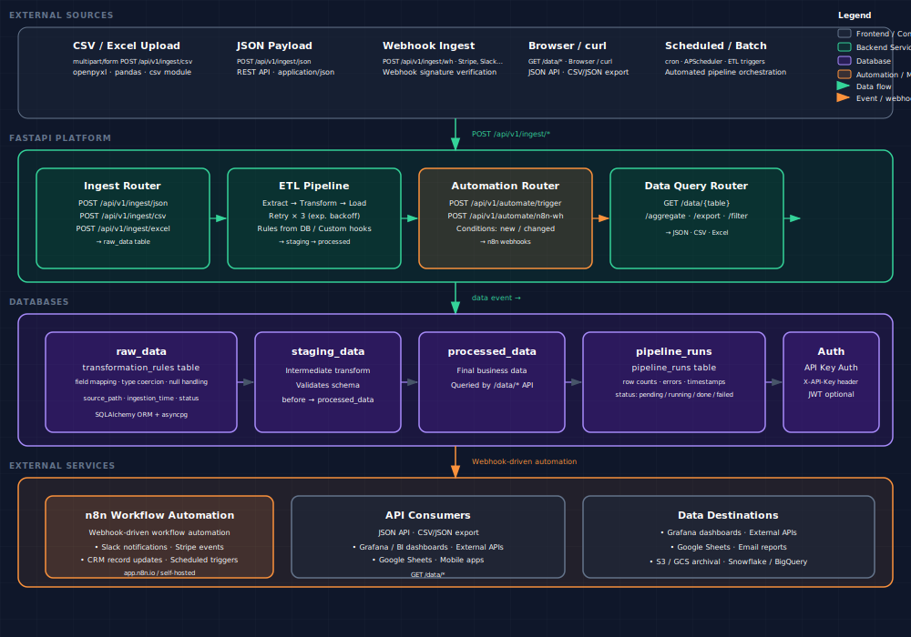

# Data & Workflow Automation Platform

> ETL pipelines, data ingestion, and n8n workflow automation — in production in ~5 minutes.

**Built by: KMan | AI-Augmented Engineering Factory**

---

## Business Problem Solved

A small/mid-sized business needs to automate their data workflows so information moves cleanly from collection to action without manual work. The focus is practical implementation — not theory — with strong attention to reliability and clarity of data flow.

**Core problem:** Manual data entry and transfer between forms, APIs, spreadsheets, and databases is error-prone and time-consuming. A single source of truth is needed.

**Core solution:** A Python-powered data automation platform that pulls data from REST APIs, databases (PostgreSQL), and Excel/CSV files, transforms and structures data through ETL pipelines, exposes data via REST API for dashboards and downstream consumers, and triggers automated actions via n8n workflows.

---

## Scope

The system has four layers; the implementation covers all of them.

### 1. **Data Ingestion API**
- REST endpoints for JSON, CSV, Excel file upload, and webhook payloads
- Background job tracking (pending → running → done/failed)
- Source-annotated raw storage with timestamps

### 2. **ETL Pipeline**
- Configurable transformation rules stored in PostgreSQL (no code changes for new rules)
- Built-in transformations: type coercion, date parsing, currency normalization, null handling
- Custom transformation hooks: define Python functions registered via API
- Retry logic: 3 attempts with exponential backoff on transient failures

### 3. **Data Storage & Query API**
- Three-tier storage: `raw_data` → `staging_data` → `processed_data`
- Query API with pagination, filtering, aggregation, and CSV/JSON export
- Transformation rules stored in `transformation_rules` table

### 4. **Automation Triggers (n8n Integration)**
- Trigger n8n webhooks on data events (new data, data changed, threshold exceeded, scheduled)
- Configurable webhook URL per pipeline
- Internal `POST /api/v1/automate/trigger` for event-driven orchestration

---

## 🏗 Technical Stack

| **Category** | **Tech** |
|---|---|
| **Languages & Runtimes** | Python |
| **Web Frameworks** | FastAPI |
| **Databases** | PostgreSQL |
| **ORMs** | SQLAlchemy |
| **Infrastructure** | Docker |
| **Automation** | n8n |

_See SPEC.md for the full tech stack and rationale._

---

## Architecture

<p align="center">
  
</p>

_Local view: `xdg-open diagrams/architecture.svg`_

### Component Overview

| Layer | Component | Description |
|---|---|---|
| **External** | CSV / Excel / REST / Webhooks | Data sources and consumers |
| **API** | Ingest Router | `POST /api/v1/ingest/{json,csv,excel}` |
| **API** | ETL Pipeline | Extract → Transform → Load with retry |
| **API** | Automation Router | `POST /api/v1/automate/{trigger,n8n-wh}` |
| **API** | Data Query | `GET /data/{t}/aggregate/export/filter` |
| **Data** | PostgreSQL | raw_data, staging_data, processed_data, pipeline_runs |
| **Automation** | n8n | Slack, Stripe, CRM, scheduled workflows |
| **Consumer** | Downstream | Grafana, BI dashboards, mobile, Google Sheets |

---

## ✅ Acceptance Criteria

1. **API endpoint working end-to-end** — at minimum one data ingestion or query flow from request to database response
2. **Database models** — schema defined with ≥3 entities, migrations ready
3. **Authentication** — JWT or session auth on at least one protected endpoint
4. **ETL pipeline** — at least one transformation from raw input to structured output
5. **Tests** — pytest with ≥5 passing tests covering core functionality
6. **Docker** — project builds and runs via `docker compose up --build`
7. **README** — complete run instructions, architecture diagram, and feature list

---

## 🚀 Quick Start

```bash
# 1. Clone and enter
git clone https://github.com/9KMan/data-workflow-automation.git && cd data-workflow-automation

# 2. Configure environment
cp .env.example .env
# Edit .env — set API_KEY, DATABASE_URL, N8N_WEBHOOK_URL

# 3. Start everything (app + PostgreSQL)
docker compose up --build

# 4. Verify
curl http://localhost:8000/api/v1/health/
# → {"status":"ok","database":"connected"}
```

---

## 📦 What's in this repo

- `SPEC.md` — full job specification (source of truth)
- `ROADMAP.md` — phased delivery plan
- `CLAUDE.md` — operating notes for AI build workers
- `app/` — application source
- `Dockerfile`, `docker-compose.yml` — container build
